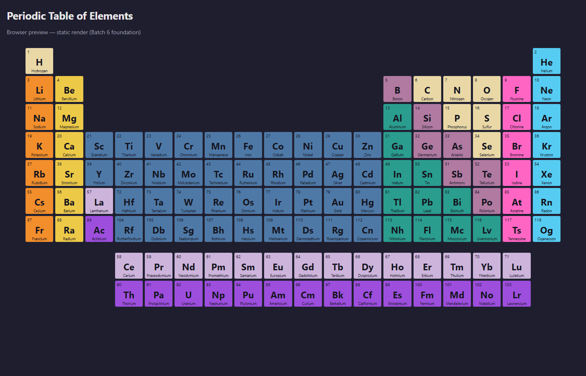

# Periodic Table — Browser Version

Browser version of the desktop Periodic Table app, built with
[Reflex](https://reflex.dev) (Python that compiles to a React frontend
backed by a FastAPI/Granian Python backend).

This is a separate, independently runnable project that **shares the
desktop app's domain and data layers** as a single source of truth — no
file is duplicated.

## Status

Foundation only (Batch 6 of the browser-version roadmap). The app
currently renders a static, color-coded periodic table. There is no
interactivity, no search, no info card, no localization, no theme
switcher yet — those land in the following batches.



## Prerequisites

- Python 3.14 (the same version the desktop app targets).
- Node.js LTS installed on your system. Reflex uses [Bun](https://bun.sh)
  for the JS toolchain and downloads it automatically on the first
  `reflex init`/`reflex run`.

## Setup

From the repository root:

```bash
cd web
python -m venv .venv

# Windows (Git Bash):
.venv/Scripts/python.exe -m pip install -r requirements.txt

# macOS / Linux:
.venv/bin/python -m pip install -r requirements.txt
```

The desktop project uses its own venv at the repository root
(`/.venv/`); keep the browser venv (`web/.venv/`) separate to avoid
PySide6 vs. Reflex dependency conflicts.

## Run the dev server

```bash
cd web
.venv/Scripts/reflex.exe run        # Windows (Git Bash)
# or
.venv/bin/reflex run                # macOS / Linux
```

Reflex starts:
- the frontend on http://localhost:3000
- the FastAPI/Granian backend on http://localhost:8000

Open http://localhost:3000 in a browser. The first start compiles the
React bundle and may take a minute; subsequent starts are fast.

## Folder layout

```
web/
├── .venv/                       # virtualenv (gitignored)
├── .web/                        # Reflex/React build artifacts (gitignored)
├── assets/                      # static assets served by the frontend
├── periodic_table_web/
│   ├── __init__.py              # adds repo root to sys.path
│   ├── periodic_table_web.py    # Reflex App + index page
│   └── theme.py                 # palette / colors
├── requirements.txt             # pinned to reflex==0.9.1
├── rxconfig.py                  # Reflex project configuration
└── README.md
```

## Single source of truth

`web/periodic_table_web/__init__.py` inserts the repository root into
`sys.path` so the Reflex app can import:

- `src.services.data_loader` — JSON loaders for `data/raw/elements.json`
  and friends.
- `src.domain.*` — pure-Python parsers and chemistry logic.

`src.ui.*` is **never imported** from the web app: it depends on
PySide6, which has no place in the Reflex runtime.

When the desktop app's data files change, the browser version picks
them up automatically — no sync step.

## Roadmap

- **Batch 6 (this batch)** — project scaffolding, static periodic table
  grid, color-coded by category.
- **Batch 7** — element selection, info card panel, search box, and
  trend recoloring controls (Macro / Radius / Ionization / Electron
  Affinity / Electronegativity / Metallic / Nonmetallic).
- **Batch 8** — electron configuration view and Lewis diagram rendering.
- **Batch 9** — tool area: molar mass, stoichiometry, compound builder,
  solubility lookup.
- **Batch 10** — i18n (the 7 desktop locales), theme switcher, and a
  deployable build (Docker / Reflex Hosting).
