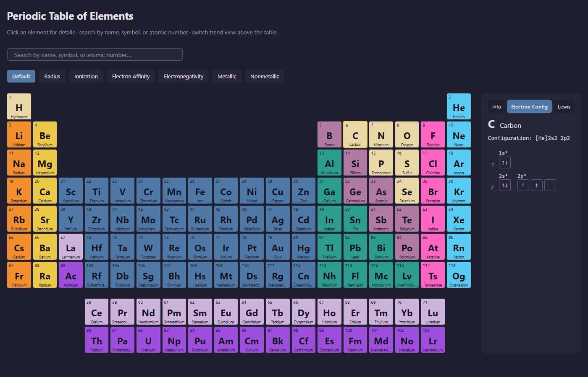

# Periodic Table — Browser Version

Browser version of the desktop Periodic Table app, built with
[Reflex](https://reflex.dev) (Python that compiles to a React frontend
backed by a FastAPI/Granian Python backend).

This is a separate, independently runnable project that **shares the
desktop app's domain and data layers** as a single source of truth — no
file is duplicated.

## Status

Batch 8 closed (alternate right-panel views). The right card now has
three tabs at the top — **Info**, **Electron Config**, and **Lewis** —
that switch what the panel shows for the currently selected element:

- **Info** (default) — the same property sheet shipped in Batch 7
  (atomic mass, category, electron configuration string, trends, …).
- **Electron Config** — orbital diagram with one box per orbital and
  ↑↓ arrows filled per Hund's rule. Noble-gas prefixes are kept in
  the configuration string at the top *and* the inner-shell
  occupancies are also rendered visually, so e.g. Iron's `[Ar]3d6 4s2`
  shows the full 1s/2s/2p/3s/3p stack, then 3d⁶ and 4s². Aufbau
  exceptions in the dataset (Cr, Cu, …) are honoured verbatim — the
  view never normalizes them.
- **Lewis** — Lewis dot diagram (single atoms only): the symbol in
  the centre of an SVG with up to 8 dots placed top → right →
  bottom → left following Hund's rule, plus a small valence /
  lone-pairs / unpaired-electrons summary. Transition metals get the
  outer s+p count and an *"extended octet — see electron
  configuration for d/f shells"* note instead of a misleading dash.

Carried over from Batch 7: element selection, search filter (25 %
opacity for non-matches), 7 trend recolorings, and the responsive
column-to-row layout below `lg`.

Still missing (intentionally — see roadmap below): tool area for
molar mass / stoichiometry / compound builder (Batch 9), and
i18n / theme switcher / deploy build (Batch 10). Multi-atom Lewis
structures are deferred past Batch 9.



## Prerequisites

- Python 3.14 (the same version the desktop app targets).
- Node.js LTS installed on your system. Reflex uses [Bun](https://bun.sh)
  for the JS toolchain and downloads it automatically on the first
  `reflex init`/`reflex run`.

## Setup

From the repository root:

```bash
cd web
python -m venv .venv

# Windows (Git Bash):
.venv/Scripts/python.exe -m pip install -r requirements.txt

# macOS / Linux:
.venv/bin/python -m pip install -r requirements.txt
```

The desktop project uses its own venv at the repository root
(`/.venv/`); keep the browser venv (`web/.venv/`) separate to avoid
PySide6 vs. Reflex dependency conflicts.

## Run the dev server

```bash
cd web
.venv/Scripts/reflex.exe run        # Windows (Git Bash)
# or
.venv/bin/reflex run                # macOS / Linux
```

Reflex starts:
- the frontend on http://localhost:3000
- the FastAPI/Granian backend on http://localhost:8000

Open http://localhost:3000 in a browser. The first start compiles the
React bundle and may take a minute; subsequent starts are fast.

## Folder layout

```
web/
├── .venv/                       # virtualenv (gitignored)
├── .web/                        # Reflex/React build artifacts (gitignored)
├── assets/                      # static assets served by the frontend
├── periodic_table_web/
│   ├── __init__.py              # adds repo root to sys.path
│   ├── periodic_table_web.py    # Reflex App, index page, UI components
│   ├── state.py                 # rx.State (selection, search, trend, panel tab)
│   ├── trends.py                # trend color helpers (lerp, gradients)
│   ├── electron_view.py         # orbital-diagram tab (boxes + Hund arrows)
│   ├── lewis_view.py            # Lewis-dot tab (SVG single-atom render)
│   └── theme.py                 # palette / colors
├── requirements.txt             # pinned to reflex==0.9.1
├── rxconfig.py                  # Reflex project configuration
└── README.md
```

## Single source of truth

`web/periodic_table_web/__init__.py` inserts the repository root into
`sys.path` so the Reflex app can import:

- `src.services.data_loader` — JSON loaders for `data/raw/elements.json`
  and friends.
- `src.domain.*` — pure-Python parsers and chemistry logic.

`src.ui.*` is **never imported** from the web app: it depends on
PySide6, which has no place in the Reflex runtime.

When the desktop app's data files change, the browser version picks
them up automatically — no sync step.

## Roadmap

- **Batch 6 — done** — project scaffolding, static periodic table
  grid, color-coded by category.
- **Batch 7 — done** — element selection, info card, search box,
  trend recoloring (Default / Radius / Ionization / Electron Affinity
  / Electronegativity / Metallic / Nonmetallic), responsive layout.
- **Batch 8 — done (this batch)** — alternate right-panel views:
  Info / Electron Config / Lewis tabs at the top of the side card.
  Electron Config renders boxes-and-arrows orbital diagrams; Lewis
  renders single-atom dot diagrams (multi-atom molecules deferred).
- **Batch 9** — tool area: molar mass, stoichiometry, compound
  builder, solubility lookup.
- **Batch 10** — i18n (the 7 desktop locales), theme switcher, and a
  deployable build (Docker / Reflex Hosting).
