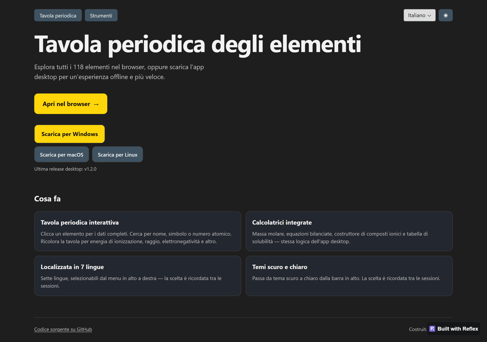

# Periodic Table — Browser Version

Browser version of the desktop Periodic Table app, built with
[Reflex](https://reflex.dev) (Python that compiles to a React frontend
backed by a FastAPI/Granian Python backend).

This is a separate, independently runnable project that **shares the
desktop app's domain and data layers** as a single source of truth — no
file is duplicated.

## Status

Batch 11 closed — the web port now mirrors the desktop visual style,
opens on a dedicated landing page with download CTAs for the desktop
installers, and ships with a deploy guide for Reflex Hosting / fly.io
/ Render.

The app has three routes — `/` for the landing page, `/table` for the
periodic table itself, and `/tools` for calculators and lookups —
linked through a header strip that also carries a 7-language selector
and a dark/light theme toggle.

`/tools` carries four tabs, each backed by the same `src.domain`
module that powers the equivalent desktop panel:

- **Molar Mass** — formula → molar mass + optional percent
  composition. Hydrate notation works (e.g. `CuSO4·5H2O` or
  `CuSO4.5H2O`).
- **Stoichiometry** — equation → balanced coefficients (sympy
  nullspace), with an optional given-compound + grams override that
  scales every row's moles and grams.
- **Compound Builder** — pick a cation element and an anion element
  (only those with the right oxidation states appear), choose the
  charge per side, and the binary formula falls out via
  criss-cross GCD.
- **Solubility** — full 14×10 cation/anion solubility matrix from
  the priority-ordered rule set, with optional row/column highlight.

Carried over from earlier batches: element selection, search,
trend recolorings, three-tab right panel (Info / Electron Config /
Lewis) on the periodic-table page.

The seven UI languages match the desktop dataset (English, Italiano,
Español, Français, Deutsch, 中文, Русский). Web-specific strings live
under `data/localization/web/{code}.json` so the desktop dataset and
its audit pipeline stay untouched. A small set of strings stays in
English by design — element category names, parser error messages
returned by `src.domain.*`, the browser document title, and the
solubility "(All)" highlight sentinel — see the batch-10 PR for the
rationale.

The light theme palette runs alongside the existing dark one. Both
are persisted via `rx.LocalStorage` so a refresh keeps the user's
language and theme choices. The Radix appearance is fixed to
`inherit`; every visible surface (page bg, foreground text, panel
cards, accent buttons, borders, inputs) is driven directly by
`ThemeState.colors` so the toggle takes effect without a page reload.

The dark and light palettes — and the per-element category swatches —
are now mirrored from the desktop QSS in `src/ui/theme.py` and
`src/ui/styles.py`, so the two surfaces look like the same product.
The web `theme.py` records the desktop source for each token in an
inline comment; future tweaks should land on the desktop side first.

The landing page at `/` greets first-time visitors with the project
overview, an "Open in browser" CTA pointing to `/table`, and a
download CTA pointing at the GitHub release for the visitor's
detected operating system. Mobile visitors see only the in-browser
CTA — the PySide6 desktop app does not target Android/iOS, and the
landing copy says so explicitly.

Multi-atom Lewis structures remain deferred.



## Prerequisites

- Python 3.14 (the same version the desktop app targets).
- Node.js LTS installed on your system. Reflex uses [Bun](https://bun.sh)
  for the JS toolchain and downloads it automatically on the first
  `reflex init`/`reflex run`.

## Setup

From the repository root:

```bash
cd web
python -m venv .venv

# Windows (Git Bash):
.venv/Scripts/python.exe -m pip install -r requirements.txt

# macOS / Linux:
.venv/bin/python -m pip install -r requirements.txt
```

The desktop project uses its own venv at the repository root
(`/.venv/`); keep the browser venv (`web/.venv/`) separate to avoid
PySide6 vs. Reflex dependency conflicts.

## Run the dev server

```bash
cd web
.venv/Scripts/reflex.exe run        # Windows (Git Bash)
# or
.venv/bin/reflex run                # macOS / Linux
```

Reflex starts:
- the frontend on http://localhost:3000
- the FastAPI/Granian backend on http://localhost:8000

Open http://localhost:3000 in a browser. The first start compiles the
React bundle and may take a minute; subsequent starts are fast.

## Docker build / deploy

The Reflex app ships with a multi-stage Dockerfile that bundles the
production frontend and the Python backend into a single image. Build
context is the repo root because the web layer reaches into `src/` and
`data/` via the sys.path bridge in `periodic_table_web/__init__.py`:

```bash
# From the repository root:
docker build -t periodic-table-web -f web/Dockerfile .

# Run the container, exposing both ports:
docker run --rm -p 3000:3000 -p 8000:8000 periodic-table-web
```

The image entry point is `reflex run --env prod`, which serves the
prerendered frontend on port 3000 and the WebSocket backend on port
8000. The `.dockerignore` at the repo root excludes the Reflex build
cache, virtualenvs, the desktop screenshots folder, and other noise
that bloats the image without contributing to the runtime.

CI verifies that the image builds cleanly on every push to `main` and
on every pull request that touches `web/`, the shared domain/services
packages, or the data tree, via
[`.github/workflows/web-docker-build.yml`](../.github/workflows/web-docker-build.yml).
The workflow runs build verification only — it does not push to a
registry.

For a hosted deploy without managing your own infrastructure,
[Reflex Hosting](https://reflex.dev/docs/hosting/deploy-quick-start/)
is the simplest path: it runs `reflex deploy` against your project
directly, no Docker step required.

Full deploy walkthrough — including fly.io and Render alternatives,
required ports, and common snags — lives in
[docs/DEPLOY.md](../docs/DEPLOY.md).

## Folder layout

```
web/
├── .venv/                       # virtualenv (gitignored)
├── .web/                        # Reflex/React build artifacts (gitignored)
├── Dockerfile                   # multi-stage build for the deployable image
├── assets/                      # static assets served by the frontend
├── periodic_table_web/
│   ├── __init__.py              # adds repo root to sys.path
│   ├── periodic_table_web.py    # Reflex App, table at /table, /tools, landing at /
│   ├── landing.py               # `/` landing — hero, OS-aware download CTAs, features
│   ├── nav.py                   # shared header (Periodic Table / Tools + lang + theme)
│   ├── state.py                 # rx.State (selection, search, trend, panel tab)
│   ├── i18n.py                  # TranslationState + 7 web/{code}.json bundles
│   ├── theme.py                 # DARK_PALETTE / LIGHT_PALETTE / palette() helper
│   ├── theme_state.py           # ThemeState (rx.LocalStorage + colors computed var)
│   ├── trends.py                # trend color helpers (lerp, gradients)
│   ├── electron_view.py         # orbital-diagram tab (boxes + Hund arrows)
│   ├── lewis_view.py            # Lewis-dot tab (SVG single-atom render)
│   └── tools/
│       ├── tools_page.py        # /tools layout + 4-tab strip
│       ├── state.py             # ToolsState (active tab)
│       ├── molar_mass_view.py
│       ├── stoichiometry_view.py
│       ├── compound_builder_view.py
│       └── solubility_view.py
├── requirements.txt             # reflex==0.9.1, sympy>=1.12
├── rxconfig.py                  # Reflex project configuration
└── README.md
```

## Single source of truth

`web/periodic_table_web/__init__.py` inserts the repository root into
`sys.path` so the Reflex app can import:

- `src.services.data_loader` — JSON loaders for `data/raw/elements.json`
  and friends.
- `src.domain.*` — pure-Python parsers and chemistry logic.
- `src.config.languages.ALL_LANGUAGE_OPTIONS` — the seven supported
  language codes + their native labels (shared with the desktop
  language picker).

`src.ui.*` is **never imported** from the web app: it depends on
PySide6, which has no place in the Reflex runtime.

When the desktop app's data files change, the browser version picks
them up automatically — no sync step.

## Roadmap

- **Batch 6 — done** — project scaffolding, static periodic table
  grid, color-coded by category.
- **Batch 7 — done** — element selection, info card, search box,
  trend recoloring (Default / Radius / Ionization / Electron Affinity
  / Electronegativity / Metallic / Nonmetallic), responsive layout.
- **Batch 8 — done** — alternate right-panel views: Info / Electron
  Config / Lewis tabs at the top of the side card. Electron Config
  renders boxes-and-arrows orbital diagrams; Lewis renders
  single-atom dot diagrams (multi-atom molecules deferred).
- **Batch 9 — done** — `/tools` route with header navigation and
  four tabs: molar mass, stoichiometry (sympy-based balancer),
  compound builder (binary ionic, criss-cross GCD), and the full
  14×10 solubility matrix.
- **Batch 10 — done** — i18n with seven locales, light/dark theme
  switcher with `rx.LocalStorage` persistence, and a multi-stage
  Docker build with CI verification.
- **Batch 11 — done (this batch)** — desktop palette and category
  colours mirrored into `theme.py`, table moved from `/` to `/table`,
  new landing page at `/` with OS-aware download CTAs, deploy guide
  for Reflex Hosting / fly.io / Render under
  [docs/DEPLOY.md](../docs/DEPLOY.md).
- **Future** — first hosted deploy + `web-v1.0.0` tag with CHANGELOG,
  end-to-end Playwright suite integrated into CI, complete i18n of
  the four English fragments noted earlier, multi-atom Lewis
  structures.
