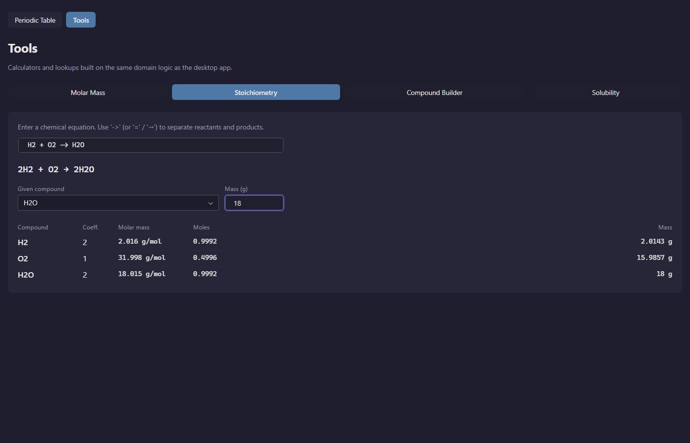

# Periodic Table — Browser Version

Browser version of the desktop Periodic Table app, built with
[Reflex](https://reflex.dev) (Python that compiles to a React frontend
backed by a FastAPI/Granian Python backend).

This is a separate, independently runnable project that **shares the
desktop app's domain and data layers** as a single source of truth — no
file is duplicated.

## Status

Batch 9 closed (tools area). The app now has two routes — `/` for
the periodic table itself and `/tools` for calculators and lookups —
linked through a header strip at the top of every page.

`/tools` carries four tabs, each backed by the same `src.domain`
module that powers the equivalent desktop panel:

- **Molar Mass** — formula → molar mass + optional percent
  composition. Hydrate notation works (e.g. `CuSO4·5H2O` or
  `CuSO4.5H2O`).
- **Stoichiometry** — equation → balanced coefficients (sympy
  nullspace), with an optional given-compound + grams override that
  scales every row's moles and grams.
- **Compound Builder** — pick a cation element and an anion element
  (only those with the right oxidation states appear), choose the
  charge per side, and the binary formula falls out via
  criss-cross GCD.
- **Solubility** — full 14×10 cation/anion solubility matrix from
  the priority-ordered rule set, with optional row/column highlight.

Carried over from earlier batches: element selection, search,
trend recolorings, three-tab right panel (Info / Electron Config /
Lewis) on the periodic-table page.

Still missing (see roadmap): i18n with the seven desktop locales,
theme switcher, and a deployable build (Docker / Reflex Hosting) —
all three land in Batch 10. Multi-atom Lewis structures remain
deferred.



## Prerequisites

- Python 3.14 (the same version the desktop app targets).
- Node.js LTS installed on your system. Reflex uses [Bun](https://bun.sh)
  for the JS toolchain and downloads it automatically on the first
  `reflex init`/`reflex run`.

## Setup

From the repository root:

```bash
cd web
python -m venv .venv

# Windows (Git Bash):
.venv/Scripts/python.exe -m pip install -r requirements.txt

# macOS / Linux:
.venv/bin/python -m pip install -r requirements.txt
```

The desktop project uses its own venv at the repository root
(`/.venv/`); keep the browser venv (`web/.venv/`) separate to avoid
PySide6 vs. Reflex dependency conflicts.

## Run the dev server

```bash
cd web
.venv/Scripts/reflex.exe run        # Windows (Git Bash)
# or
.venv/bin/reflex run                # macOS / Linux
```

Reflex starts:
- the frontend on http://localhost:3000
- the FastAPI/Granian backend on http://localhost:8000

Open http://localhost:3000 in a browser. The first start compiles the
React bundle and may take a minute; subsequent starts are fast.

## Folder layout

```
web/
├── .venv/                       # virtualenv (gitignored)
├── .web/                        # Reflex/React build artifacts (gitignored)
├── assets/                      # static assets served by the frontend
├── periodic_table_web/
│   ├── __init__.py              # adds repo root to sys.path
│   ├── periodic_table_web.py    # Reflex App, index page, /tools registration
│   ├── nav.py                   # shared header (Periodic Table / Tools)
│   ├── state.py                 # rx.State (selection, search, trend, panel tab)
│   ├── trends.py                # trend color helpers (lerp, gradients)
│   ├── electron_view.py         # orbital-diagram tab (boxes + Hund arrows)
│   ├── lewis_view.py            # Lewis-dot tab (SVG single-atom render)
│   ├── theme.py                 # palette / colors
│   └── tools/
│       ├── tools_page.py        # /tools layout + 4-tab strip
│       ├── state.py             # ToolsState (active tab)
│       ├── molar_mass_view.py
│       ├── stoichiometry_view.py
│       ├── compound_builder_view.py
│       └── solubility_view.py
├── requirements.txt             # reflex==0.9.1, sympy>=1.12
├── rxconfig.py                  # Reflex project configuration
└── README.md
```

## Single source of truth

`web/periodic_table_web/__init__.py` inserts the repository root into
`sys.path` so the Reflex app can import:

- `src.services.data_loader` — JSON loaders for `data/raw/elements.json`
  and friends.
- `src.domain.*` — pure-Python parsers and chemistry logic.

`src.ui.*` is **never imported** from the web app: it depends on
PySide6, which has no place in the Reflex runtime.

When the desktop app's data files change, the browser version picks
them up automatically — no sync step.

## Roadmap

- **Batch 6 — done** — project scaffolding, static periodic table
  grid, color-coded by category.
- **Batch 7 — done** — element selection, info card, search box,
  trend recoloring (Default / Radius / Ionization / Electron Affinity
  / Electronegativity / Metallic / Nonmetallic), responsive layout.
- **Batch 8 — done** — alternate right-panel views: Info / Electron
  Config / Lewis tabs at the top of the side card. Electron Config
  renders boxes-and-arrows orbital diagrams; Lewis renders
  single-atom dot diagrams (multi-atom molecules deferred).
- **Batch 9 — done (this batch)** — `/tools` route with header
  navigation and four tabs: molar mass, stoichiometry (sympy-based
  balancer), compound builder (binary ionic, criss-cross GCD), and
  the full 14×10 solubility matrix.
- **Batch 10** — i18n (the 7 desktop locales), theme switcher, and a
  deployable build (Docker / Reflex Hosting).
